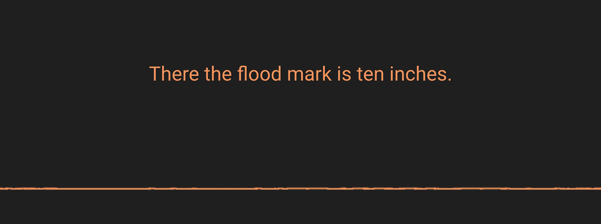
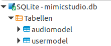
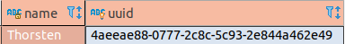
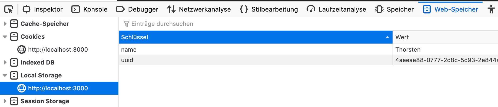

# Mimic Recording Studio



- [Mimic Recording Studio](#mimic-recording-studio)
  * [Software Quick Start](#software-quick-start)
    + [Windows self-hosted Quick Start](#windows-self-hosted-quick-start)
    + [Linux/Mac self-hosted Quick Start](#linux-mac-self-hosted-quick-start)
      - [Install Dependencies](#install-dependencies)
      - [Build and Run](#build-and-run)
    + [Manual Install, Build and Start](#manual-install--build-and-start)
      - [Backend](#backend)
        * [Dependencies](#dependencies)
        * [Build & Run](#build---run)
      - [Frontend](#frontend)
        * [Dependencies](#dependencies-1)
        * [Build & Run](#build---run-1)
    + [Coming soon!](#coming-soon-)
  * [Data](#data)
    + [Audio Recordings](#audio-recordings)
      - [WAV files](#wav-files)
      - [{uuid}-metadata.txt](#-uuid--metadatatxt)
    + [Corpus](#corpus)
      - [Corpora in other languages](#corpora-in-other-languages)
  * [Technologies](#technologies)
    + [Frontend](#frontend-1)
      - [Functions](#functions)
    + [Backend](#backend-1)
      - [Functions](#functions-1)
    + [Docker](#docker)
- [Recording Tips](#recording-tips)
- [Advanced](#advanced)
  * [Query database structure](#query-database-structure)
    * [Table "audiomodel"](#table-"audiomodel")
    * [Table "usermodel"](#table-"usermodel")
  * [Modify recorder uuid](#modify-recorder-uuid)
- [Providing your recording to Mycroft for training](#providing-your-recording-to-mycroft-for-training)
- [Contributions](#contributions)
- [Where to get support and assistance](#where-to-get-support-and-assistance)

The [Mycroft](https://mycroft.ai) open source Mimic technologies are
Text-to-Speech engines which take a piece of written text and convert it into
spoken audio. The latest generation of this technology,
[Mimic 2](https://github.com/MycroftAI/mimic2), uses machine learning techniques
to create a model which can speak a specific language, sounding like the voice
on which it was trained.

The Mimic Recording Studio simplifies the collection of training data from
individuals, each of which can be used to produce a distinct voice for Mimic.


## Software Quick Start

### Windows self-hosted Quick Start

* `git clone https://github.com/MycroftAI/mimic-recording-studio.git`
* `cd mimic-recording-studio`
* `start-windows.bat`


### Linux/Mac self-hosted Quick Start

#### Install Dependencies
* [Docker](https://docs.docker.com/) (community edition is fine)
* [Docker Compose](https://docs.docker.com/compose/install/)

Why docker? To make this super easy to set up and run cross platforms.

#### Build and Run

* `git clone https://github.com/MycroftAI/mimic-recording-studio.git`
* `cd mimic-recording-studio`
* `docker-compose up` to build and run (_Note: You may need to use `sudo docker-compose up` depending on your distribution_)

  Alternatively, you can build and run separately. `docker-compose build` then `docker-compose up`
* In your browser, go to `http://localhost:3000`

**Note:**
The first execution of `docker-compose up` will take a while as this command will also build the docker containers. Subsequent executions of `docker-compose up` should be quicker to boot.

### Manual Install, Build and Start

#### Backend

##### Dependencies

* python 3.5 +
* [ffmpeg](https://www.ffmpeg.org/)

##### Build & Run

* `cd backend/`
* `pip install -r requirements.txt`
* `python run.py`

#### Frontend

##### Dependencies

* [node & npm](https://nodejs.org/en/)
* [create-react-app](https://github.com/facebook/create-react-app)
* [yarn](https://yarnpkg.com/en/) - optional for faster build, install, and start

##### Build & Run

* `cd frontend/`
* `npm install`, alternatively `yarn install`
* `npm start`, alternatively `yarn start`

### Coming soon!
Online, http://mimic.mycroft.ai hosted version requiring zero setup.


## Data

### Audio Recordings

#### WAV files

Audio is saved as WAV files to the `backend/audio_file/{uuid}/` directory. The
backend automatically trims the beginning and ending silence for all WAV files
using [ffmpeg](https://www.ffmpeg.org/).

#### {uuid}-metadata.txt

Metadata is also saved to `backend/audio_file/{uuid}/`. This file maps the WAV
file name to the phrase spoken. This along with the WAV files are what you
needed to get started on training [Mimic 2](https://github.com/MycroftAI/mimic2).

### Corpus

For now, we have an English corpus, `english_corpus.csv` made available which
can be found in `backend/prompt/`. To use your own corpus follow these steps.

1. Create a csv file in the same format as `english_corpus.csv` using tabs
   (`\t`) as the delimiter.
2. Make sure there are no empty lines in the corpus
3. Add your corpus to the `backend/prompt` directory.
4. Change the `CORPUS` environment variable in `docker-compose.yml` to your
   corpus name.
   
#### Corpora in other languages

If you wish to develop a corpus in a language other than English, then Mimic Recording Studio can be used to produce voice recordings for TTS voices in additional languages. If you are building a corpus in a language other than English, we encourage you to choose phrases which: 

* occur in natural, everyday speech in the target language
* have a variety of string lengths
* cover a wide variety of _phonemes_ (basic sounds)

**IMPORTANT:**
For now, you must reset the `sqlite` database to use a new corpus. If you've
recorded on another corpus and would like to save that data, you can simply
rename your `sqlite` db found in `backend/db/` to another name. The backend will
detect that `mimicstudio.db` is not there and create a new one for you. You may
continue recording data for your new corpus.

## Technologies

### Frontend

The web UI is built using Javascript and [React](https://reactjs.org/) and
[create-react-app](https://github.com/facebook/create-react-app) as a
scaffolding tool. Refer to [CRA.md](/frontend/CRA.md) to find out more on how to
use create-react-app.

#### Functions

* Record and play audio
* Generate audio visualization
* Calculate and display metrics

### Backend

The web service is built using Python, [Flask](http://flask.pocoo.org/) as the
backend framework, [gunicorn](https://gunicorn.org/) as a http webserver, and
[sqlite](https://www.sqlite.org/index.html) as the database.

#### Functions

* Process audio
* Serves corpus and metrics data
* Record info in database
* Record data to the file system

### Docker

Docker is used to containerize both applications. By default, the frontend uses
network port `3000` while the backend uses networking port `5000`. You can
configure these in the `docker-compose.yml` file.

_NOTE: If you are running `docker-registry`, this runs by default on port `5000`, so you will need to change which port you use._

# Recording Tips

Creating a voice requires an achievable, but significant effort. An individual will need to record 15,000 - 20,000 phrases.  In order to get the best possible Mimic voice, the recordings need to be clean and consistent. To  that end, follow these recommendations:

* Record in a quiet environment with noise-dampening material.
  If your ears can hear outside noise, so can the microphone. For best results,
  even the sound of air conditioning blowing through a vent should be avoided.
  Bare walls create subtle echoes and reverberation.  A sound dampening booth
  is ideal, but you can also create a homemade recording studio using soft
  materials such as acoustic foam in a closet.  Comforters and mattresses can
  also be used effectively!
* Speak at a consistent volume and speed.  Rushing through the phrases will only
  result in a lower quality voice.
* Use a quality microphone.
  To obtain consistent results, we recommend a headset microphone so your mouth
  is always the same distance from the mic.
* Avoid vocal fatigue.
  Record a maximum of 4 hours a day, taking a break every half hour.
* Backup your Mimic-Recording-Studio directory on a regular basis to avoid data loss.

# Advanced

## Query database structure
Mimic-Recording-Studio writes all recordings in a sqlite database file located under /backend/db/. This can be opened with database tools like DBeaver.

The database includes two tables.



### Table "audiomodel"
All recordings are persisted in this table with 
* recording timestamp (created_date)
* uuid of speaker (matches the filesystem path under /backend/audio_files/id)
* wav filename in filesystem (audio_id)
* text of recorded phrase (phrase)

The database can be used to query your recordings.

Here are some example queries:

```sql
-- List all recordings
SELECT * FROM audiomodel;

-- Lists recordings from january 2020 order by phrase
SELECT * FROM audiomodel WHERE created_date BETWEEN '2020-01-01' AND '2020-01-31' ORDER BY prompt;

-- Lists number of recordings per day
SELECT DATE(created_date), COUNT(*) AS RecordingsPerDay
FROM audiomodel
GROUP BY DATE(created_date )
ORDER BY DATE(created_date)

-- Shows average text length of recordings
SELECT AVG(LENGTH(prompt)) AS avgLength FROM audiomodel
```

There are many ways that querying the sqlite database might be useful. For example, looking for recordings in a specific time range might help to remove recordings made in a bad environment.

### Table "usermodel"
Mimic-Recording-Studio can be used by more than one speaker using the same sqlite database file.

This tables provides following informations per speaker:
* Unique identifier of speaker (uuid)
* Name of speaker (user_name)
* Newest recorded line number of corpus (prompt_num)
* Total recording time (total_time_spoken)
* How many chars have been recorded (len_char_spoken)

These values are used to calculate metrics. For example, the speaking pace may show if the recorded phrase is too fast or slow compared to previous recordings.

Query table "usermodel" to get a list of speakers including uuid and some recording statistics on them.

```sql
SELECT user_name AS [name], uuid FROM usermodel;
```




## Modify recorder uuid
The browser used to record your phrases persists the users `uuid` and `name` in it's localStorage to keep it synchronous with sqlite and filesystem.

If a problem occurs and your browser looses/changes uuid mapping for Mimic-Recording-Studio you could have difficulties to continue a previous recording session.
Then update the following two attributes in localStorage of your browser:

* uuid ([Query table "usermodel"](#table-"usermodel") or check filesystem path under /backend/audio_files/)
* name ([Query table "usermodel"](#table-"usermodel"))


Open Mimic-Recording-Studio in your browser, jump to web-developer options, localStorage and set name and uuid to the original values.



After that you should be able to continue your previous recording session without further problems.

# Providing your recording to Mycroft for training

We welcome your voice donations to Mycroft for use in Text-to-Speech applications. If you would like to provide your voice recordings, you _must_ license them to us under the Creative Commons [CC0 Public Domain license](https://creativecommons.org/share-your-work/public-domain/cc0/) so that we can utilise them in TTS voices - which are derivative works. If you're ready to donate your voice recordings, email us at hello@mycroft.ai. 

# Contributions

PR's are gladly accepted!

# Where to get support and assistance

You can get help and support with Mimic Recording Studio at; 

* The [Mycroft Forum](https://community.mycroft.ai)
* In [Mycroft Chat](https://chat.mycroft.ai)
